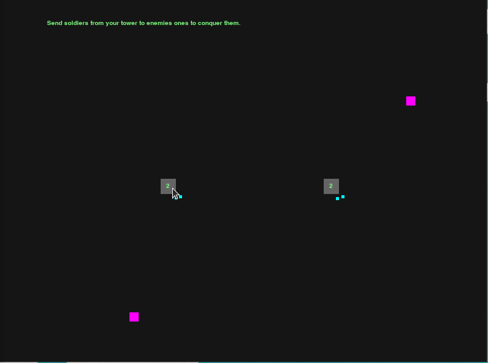

# Player Guides

In this section is explain the entire game for players. Rules are really simple.

_Above: An early game screen example_

## Objective

You are a [Ruler](#ruler) of a kingdom made by [Towers](#tower). You have to conquer unclaimed towers and towers controlled by other players. If a Ruler don't control any tower, it lose the game. The last Ruler in play is the winner.

## How to play

### How to conquer a tower

You have to send your soldiers to towers controlled by other players. If there are defending soldiers, your soldiers will fight them. One attacker soldier kill one defending soldiers. When there are no defending soldiers, the tower become unclaimed. When one another soldier enter the tower, the ruler controlling that soldier gain the control of the tower.

### How to send soldiers

To send your soldiers to another tower, you have to create a route between the two towers. You can create routes only starting from one of your towers. Click on one of your towers to create a path that your soldiers will have to take. When you successfully link two towers with that path, you confirm the order and it will be created over time until it is completed. You can cancel a path that is not being build clicking with the mouse right button on any point of the screen.

Pay attention! Soldiers from each side of a route can go from one side to the other!

### How to defend your towers

You can defend your towers in two methods:

1. You can send your soldiers to defend your towers. If their number is greater than the attackers, they will protect your towers!
2. With your ruler, you can interrupt a created route going through with your ruler. That route will be disrupt in the point where your ruler is passed through to each side. Any soldier on that point will be killed. Other soldiers in that path will wait for the path to be re-builded.

You can select one of your towers and choose one enemy tower where send soldiers. When your soldiers arrive, they fight with defending enemy soldiers, killing and being killed. If attackers soldiers kill all defending ones, they will conquer the tower.

## Game entities

### Ruler

A ruler is the king of the kingdom and has to defend and attack towers. You can directly control it. Read more on [Ruler page](/players/entities/ruler).

### Soldier

Is generated by a tower and can attack or protect them. You can send soldiers to other towers, creating a [Route](#route) between them. If he encounter an enemy, they will fight, kill each other.

### Tower

Is a blank square in the map and is a part of your kingdom. Read more on [Tower Page](entities/tower).

### Route

A route is created as a link between two towers. Using it, soldiers can go from one tower to another one to attack or protect it. A route can be used from both sides, so pay attention before creating one: you can use that route, but enemies can do the same!

You can create a Route by click on one of towers controlled by you and clicking on another one. If you dislike the path you created, you can click with right mouse button to abort the command and cancel the route creation.
